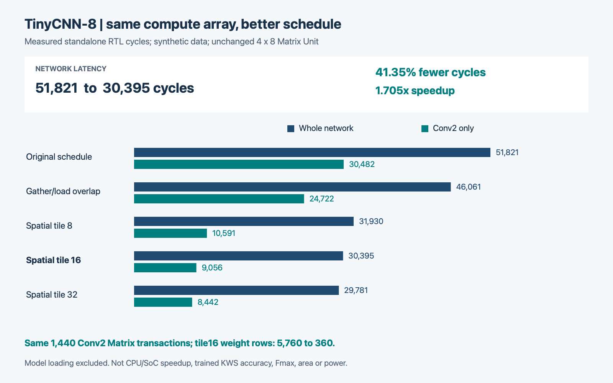
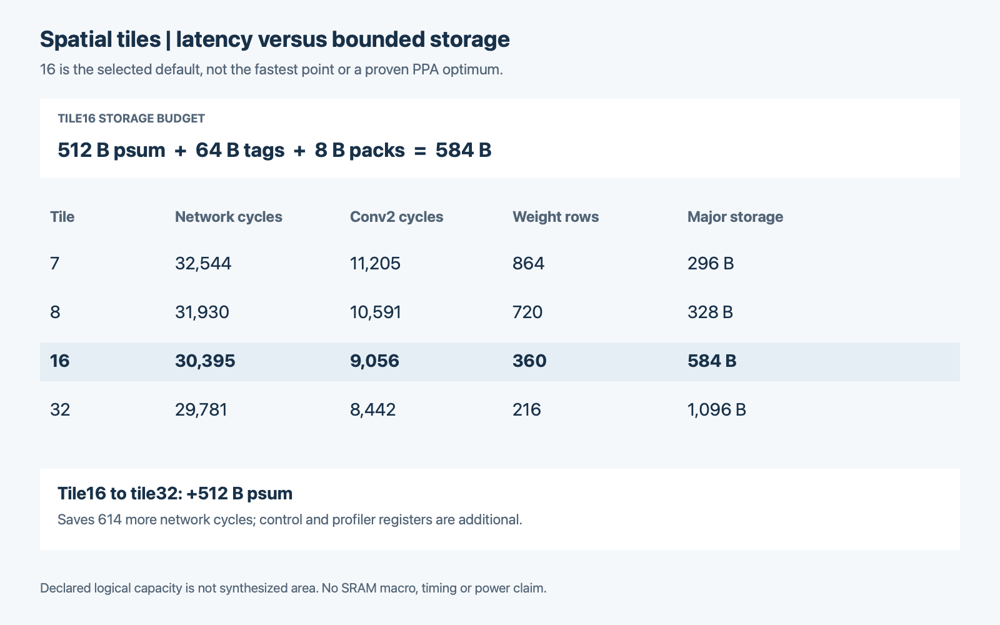

# TinyCNN-8：空间复用、trade-off 与综合前完成度

## 核心结论

相同4×8阵列、同一固定网络、相同合成参数及行为存储契约下，tile16 的整网周期
**51,821 → 30,395**，减少 **41.35%**，速度比 **1.705×**；Conv2
**30,482 → 9,056**，速度比 **3.366×**。C2 Matrix输入仍为1,440笔，
权重行由5,760降至360，减少93.75%。主要 tiled 数据存储为584B，不等于综合面积。

完整实验有 **12 个网络用例、224,740 次逐层元素比较**，
另有 **63 项记录的单元/配置/oracle/MMIO回归**；正式 MMIO 覆盖
24 个模式/用例组合、每组合3次连续任务。日志是有限测试证据，不是形式证明。

**范围：synthetic 参数和输入、独立NPU及生产MMIO后端、组合行为存储。未完成真实KWS
准确率、CPU/AXI整SoC仿真、综合、STA、频率、面积或功耗验证。**

## 1. 基础与增量

基于主线 `46d759b`：团队已有Matrix/Vector、TinyCNN/Q31以及正式SoC wrapper。
本次没有重写这些基础，也没有复制第二套Matrix核。

新增工作：三路可切换调度、K-major空间复用、多在途事务回收、独立整数golden、
事件trace、参数扫、生命周期验证、软件可读profiler与可复现回归/CI。

旧阶段11.12%结果是 gather/load overlap 的独立贡献；它不减少权重装载，不能与
本次 tiled 的节约量相加。新实验用最新主线与同一观察器重新比较。

## 2. 为什么优化调度，不先加PE

两层卷积都是8个输出通道，匹配现有8列。Conv2约占名义MAC的三分之二。
原调度每个空间位置、每个K组都重载四行权重，并等待一笔Matrix结果。
第一阶段重叠数据准备后，仍有约64%的C2周期在等结果。

新循环顺序：空间tile → 18个K组 → tile内位置。同一权重组装载一次，服务多个
位置；连续收集/发射期间也接收返回结果。按tag把INT32部分和写回各位置。
本组全部退休、Matrix idle后才能换权重；最后一组完成后串行量化/写回。

当前activation口每拍1byte，实施版每个pack收集4拍、发射1拍；两个pack交替使用，
并未把收集和发射彻底重叠成理想II=4，更不是II=1。多个计算延迟能重叠，但组间
仍需排空。权重复用不自动减少激活读取量。

## 3. 量化trade-off

| 调度 | 整网周期 | Conv2 周期 | C2 权重行 | 部分和容量 | tag/pack |
|---|---:|---:|---:|---:|---:|
| baseline | 51,821 | 30,482 | 5,760 | 32 B | 0/4 B |
| overlap | 46,061 | 24,722 | 5,760 | 32 B | 0/4 B |
| tile7 | 32,544 | 11,205 | 864 | 224 B | 64/8 B |
| tile8 | 31,930 | 10,591 | 720 | 256 B | 64/8 B |
| tile16 | 30,395 | 9,056 | 360 | 512 B | 64/8 B |
| tile32 | 29,781 | 8,442 | 216 | 1024 B | 64/8 B |






16不是最快，但相对8减少装载和排空；32把部分和容量从512B翻倍到1024B，
额外整网收益应与这个代价一起看。7用于非整除尾块验证，不作为默认配置。
32的尾块只有16个位置，不得称所有位置均有32倍复用。

默认tile16：psum 512B + integer tag FIFO 64B + 两个activation pack 8B = **584B主要数据存储**。
此外还有控制/计数寄存器、地址运算和MMIO读mux。容量只是RTL声明预算，未映射SRAM宏。
数组或integer是否被优化、选择网络是否成为关键路径，必须综合后才能回答。

## 4. 软件可见性能接口

新增只读偏移相对NPU_BASE：0x40总周期、0x44..0x58六层周期、0x5c权重行、
0x60输入事务、0x64退休事务、0x68最大在途、0x6c状态(valid/overflow/busy)。
VERSION为0x00010001；默认两种优化均关闭，参数通过subsystem→wrapper→top→conv。

接受start清零，统计START/WAIT状态边沿，包含层完成转移拍；完成冻结，clear_done
不清统计，非法start不改快照。计数32位饱和，越界递增置sticky overflow。
独立testbench按握手和状态对照，而不是读取计数器作为自己的参考。

层trace观察周期与硬件层计数边界不同，应看CSV的独立列：硬件C2比trace C2多1拍，
硬件六层之和等于总周期；trace另有CTRL残差。收益比较始终保持同口径，不混加。
主机装载周期单列，既不算核心周期，也不能称CPU/AXI吞吐。

## 5. 验证证据

- 各层每个元素与独立整数golden bit-exact，检查地址覆盖、X/Z、重复/漏写。
- 三种调度和tile7/8/16/32；边角padding、变化的tap/channel权重、signed输入、
  非零bias、非平凡量化及极值；更多固定seed和类别数。
- Matrix气泡/反压、Conv输出反压、tile尾块、busy中reset/重新装载、连续不同任务；
  换权重前排空、tag信用和issue/retire守恒有定向断言。
- 官方MMIO回归保留；新增文件驱动复杂参数、input-only复用、换模型、IRQ、done-clear、
  busy拒绝、只读保护、类别/保留shift错误及每次profile验证。
- 完整trace和日志是生成产物，PR仅包含精简摘要和可复现源码；历史Git对象不是默认依赖。

具体数目与配置见 `accepted_summary.json`。默认完整入口不允许跳过单元测试；
smoke结果不能被报告生成器当成阶段验收。CI配置随PR提交，实际CI状态应以GitHub为准，
配置存在不等于已经绿灯。

## 6. 综合之前为何可以说“阶段完成”

本阶段是**固定模型RTL功能、协议和调度验证**，不是芯片完工。

| 门槛 | 证据/范围 |
|---|---|
| 合同冻结 | 固定形状、NHWC、Q31、shift[-31,31]、mask、支持descriptor与fallback |
| 数值 | 完整网络和正式MMIO对同一独立golden，通过有限回归 |
| 协议 | 无丢失/重复，tag回收、排空、反压、reset/restart与尾块测试通过 |
| 优化机制 | C2 issue数不变，装载行符合4×18×ceil(80/T) |
| 性能 | 同阵列/数据/存储/边界，trace解释周期收益，达到设定周期目标 |
| 资源与接口 | 额外容量和端口明确，profiler经正式MMIO可读 |
| 复现 | 新目录一键流程、seed/工具/源码和结果hash；远端CI另行报告 |

因此我们可验收“限定合同下的RTL阶段”。综合要检查映射和时序，并不会替代此前
数值/协议验收。尚未完成的同步SRAM、PPA、实际时钟、物理实现、真实模型准确率与
整SoC验证，是下一阶段门槛，不写成已经完成但没有展示的数据。

## 7. 复现

```sh
python3 hardware/npu/scripts/run_tinycnn8_regression.py --output /新的空目录
python3 hardware/npu/tools/build_tiled_report.py /该结果目录 --output docs/kws_tinycnn8_tiled
swift hardware/npu/tools/render_tiled_charts.swift docs/kws_tinycnn8_tiled/performance_summary.csv docs/kws_tinycnn8_tiled
```

仿真只需Python、Icarus、vvp，不需要训练包或Swift。图表生成使用macOS AppKit，与CI回归无关。
本次工具：Icarus Verilog version 13.0 (stable) (v13_0)。源base：3a95eaf43cf5241d874e7261130e9213acd25e01，源hash在摘要。
